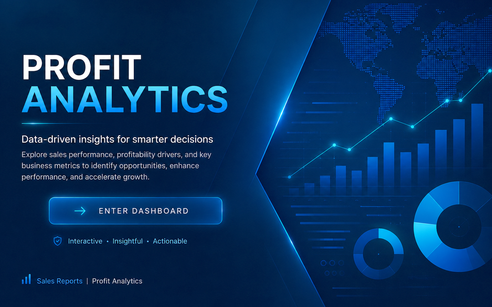
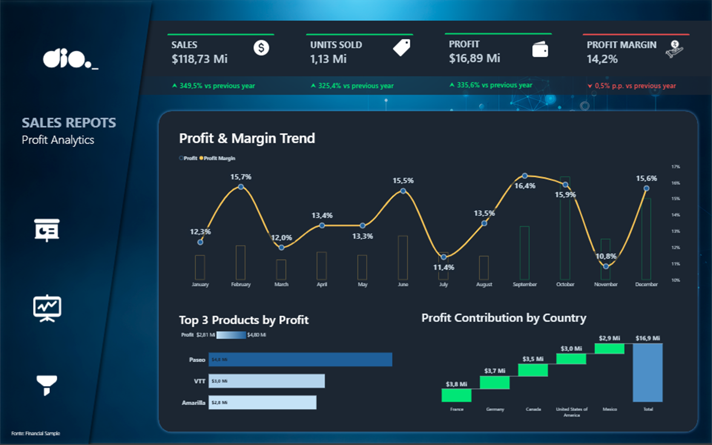
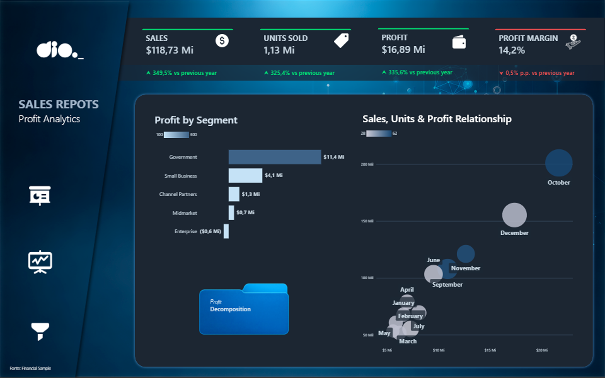
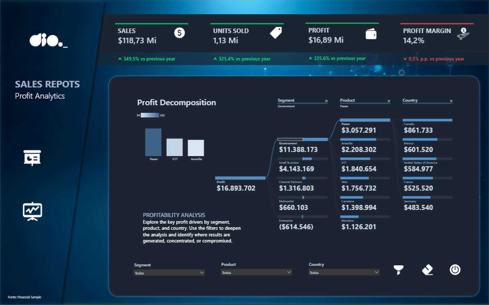
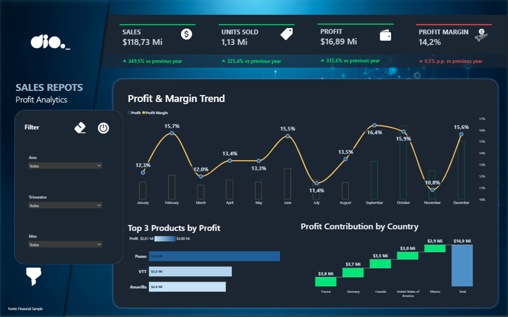

# Profit Analytics — Power BI Dashboard

> Executive Power BI dashboard focused on sales performance, profitability analysis, KPIs and interactive business insights.


---

## 📊 Project Overview

**Profit Analytics** is an interactive Power BI dashboard designed to transform sales data into clear business insights.

The project combines executive KPIs, profitability analysis, time trends, product performance, country contribution, segment analysis and interactive filtering.

The dashboard was designed with a focus on **business storytelling, analytical usability and executive decision support**.

---

## 🎯 Business Objective

The dashboard helps answer key business questions:

- How are Sales, Units Sold and Profit performing?
- How is Profit Margin evolving over time?
- Which products generate the highest profit?
- Which countries contribute most to profitability?
- Which customer segments generate or compromise profit?
- What is the relationship between Sales, Units Sold and Profit?
- What are the main drivers behind the company's profitability?

---

## 📌 Executive KPIs

The dashboard highlights four core indicators:

| KPI | Purpose |
|---|---|
| **Sales** | Total sales performance |
| **Units Sold** | Sales volume |
| **Profit** | Financial result |
| **Profit Margin** | Profitability efficiency |

Each KPI is supported by a **Previous Year comparison**, allowing immediate identification of performance changes.

---

# 📈 Dashboard

## Performance Analysis

The performance view focuses on the evolution and concentration of profitability.

### Main visuals

- **Profit & Margin Trend**
- **Top 3 Products by Profit**
- **Profit Contribution by Country**



---

## Sales, Units & Profit Relationship

This analytical view explores the relationship between:

- Sales
- Units Sold
- Profit
- Customer Segments

The objective is to identify relationships between sales volume and financial performance.



---

## Profitability Analysis

The profitability view focuses on identifying the main drivers of profit.

It allows the analysis to be broken down by:

- Segment
- Product
- Country

A **Decomposition Tree** is used to move from total profit into its main business drivers.

> Explore the key profit drivers by segment, product, and country. Use the filters to deepen the analysis and identify where profitability is generated, concentrated, or compromised.



---

## 🔎 Interactive Analysis

The dashboard uses interactive filters and navigation to allow users to move from high-level indicators into more detailed analysis.

Available analytical dimensions include:

- Year
- Quarter
- Month
- Country
- Segment
- Product



---

# 🧮 DAX & Business Logic

The project includes DAX measures designed to support the analytical layer of the dashboard.

Key calculations include:

- Sales
- Units Sold
- Profit
- Profit Margin
- Previous Year calculations
- Year-over-Year variation
- Profitability comparisons
- Analytical measures used by the visualizations

The calculations were structured around **business logic first and visualization second**, allowing the metrics to remain dynamic when filters are applied.

---

# 🎨 Dashboard Design

The interface follows an executive dark-dashboard concept designed to combine analytical density with visual clarity.

### Design principles

- Clear visual hierarchy
- Consistent KPI structure
- Dark analytical environment
- High-contrast indicators
- Green positive performance
- Red negative performance
- Consistent typography
- Interactive navigation
- Reduced visual clutter

The objective was not simply to display charts, but to create an analytical interface that guides the user from:

**KPI → Performance → Relationship → Profitability → Decision**

---

# 🖥️ Screenshots

### Executive Overview


### Performance


### Sales, Units & Profit Relationship



### Profitability


### Filters & Interaction


---

# 🎥 Dashboard Demo

A short video demonstrates the dashboard navigation and interactive analytical experience.

**[▶ Watch the Dashboard Demo](demo/dashboard-demo.mp4)**

---

# 🗂️ Project Structure

```text
power-bi-profit/
│
├── dashboard/
│   └── Sales_Report.pbix
│
├── demo/
│   └── dashboard-demo.mp4
│
├── screenshots/
│   ├── 01-home.png
│   ├── 02-dashboard-performance.png
│   ├── 03-dashboard-relationship.png
│   ├── 04-dashboard-profitability.png
│   └── 05-dashboard-filters.png
│
└── README.md
